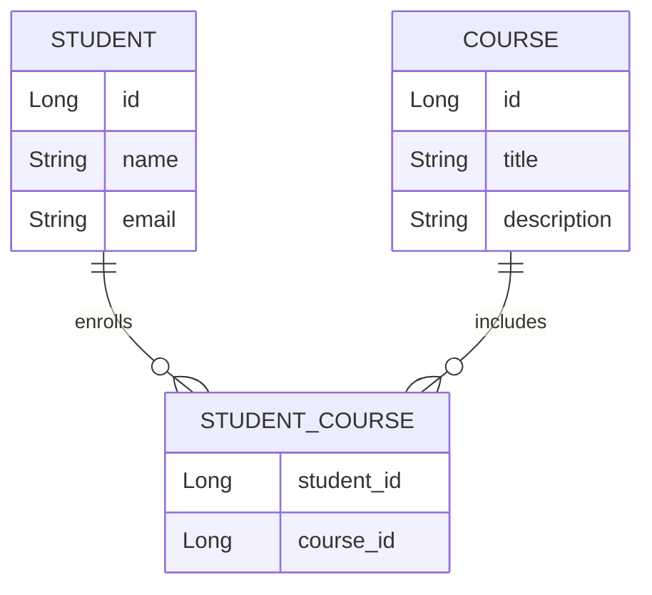
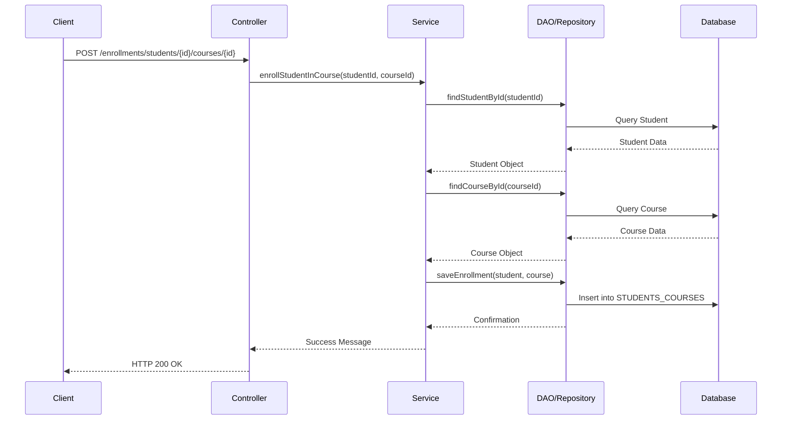
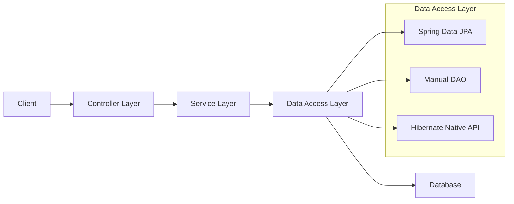

# Presentation on Data Persistence and ORM in Java

Today, we'll explore the essential concepts of **data persistence** and **Object-Relational Mapping (ORM)** in Java. We'll focus on a practical example: a **Student-Course management system**. Our goal is to understand how to persist data using three different approaches:

1. **Spring Data JPA**
2. **Manual DAO Pattern**
3. **Hibernate Native API**

By the end of this session, you'll know how each approach works, their advantages and disadvantages, and when to use them.

---

## Entities and Relationships 

Before we dive into the implementations, let's understand the **domain model** of our application.

### Entities:

- **Student**:
  - **Attributes**:
    - `id`: Unique identifier for each student.
    - `name`: Name of the student.
    - `email`: Email address of the student.

- **Course**:
  - **Attributes**:
    - `id`: Unique identifier for each course.
    - `title`: Title of the course.
    - `description`: Description of the course content.

### Relationship:

- **Many-to-Many** relationship between **Student** and **Course**:
  - A student can enroll in multiple courses.
  - A course can have multiple students enrolled.

### ER Diagram:

Here's a diagram to visualize the relationship:



In this diagram:

- **STUDENT** and **COURSE** are connected through the **STUDENT_COURSE** join table.
- The join table handles the many-to-many relationships.

---

## Approach 1: Spring Data JPA (10 minutes)

**Objective:** Learn how to use Spring Data JPA for data persistence.

### Overview

- **Spring Data JPA** simplifies database interactions by reducing boilerplate code.
- It provides a repository abstraction over the data layer.

### Key Components

1. **Repositories**:

   - **StudentRepository** and **CourseRepository** extend `JpaRepository`.
   - They provide built-in methods for CRUD operations.

   ```java
   public interface StudentRepository extends JpaRepository<Student, Long> {}
   public interface CourseRepository extends JpaRepository<Course, Long> {}
   ```

2. **Service Layer**:

   - Contains business logic.
   - Uses repositories to perform data operations.

   ```java
   @Service
   public class StudentService {
       @Autowired
       private StudentRepository studentRepository;

       public Student saveStudent(Student student) {
           return studentRepository.save(student);
       }
       // Additional methods...
   }
   ```

3. **Controller Layer**:

   - Handles HTTP requests.
   - Maps URLs to service methods.

   ```java
   @RestController
   @RequestMapping("/students")
   public class StudentController {
       @Autowired
       private StudentService studentService;

       @PostMapping
       public ResponseEntity<Student> createStudent(@RequestBody Student student) {
           Student savedStudent = studentService.saveStudent(student);
           return new ResponseEntity<>(savedStudent, HttpStatus.CREATED);
       }
       // Additional endpoints...
   }
   ```

### Advantages

- **Simplicity**: Less code, faster development.
- **Maintainability**: Easy to manage and extend.
- **Standardization**: Consistent approach to data access.

### Code Walkthrough

- **Entities**:

  - Use annotations like `@Entity`, `@Table`, and `@ManyToMany`.
  - Example:

    ```java
    @Entity
    @Table(name = "students")
    public class Student {
        @Id
        @GeneratedValue(strategy = GenerationType.IDENTITY)
        private Long id;

        private String name;
        private String email;

        @ManyToMany
        @JoinTable(
            name = "students_courses",
            joinColumns = @JoinColumn(name = "student_id"),
            inverseJoinColumns = @JoinColumn(name = "course_id")
        )
        private Set<Course> courses = new HashSet<>();

        // Getters and setters...
    }
    ```

- **Repositories**:

  - Extend `JpaRepository` to inherit CRUD operations.
  - No need to write implementation code.

- **Services and Controllers**:

  - Use `@Service` and `@RestController` annotations.
  - Leverage dependency injection with `@Autowired`.

---

## Approach 2: Manual DAO Pattern

**Objective:** Understand how to manually interact with the database using the DAO pattern.

### Overview

- The **DAO (Data Access Object)** pattern involves writing custom code for data operations.
- Provides full control over SQL queries and transactions.

### Key Components

1. **DAO Interfaces**:

   - Define methods for data operations.

   ```java
   public interface StudentDAO {
       void save(Student student);
       Student findById(Long id);
       List<Student> findAll();
       // Additional methods...
   }
   ```

2. **DAO Implementations**:

   - Implement the DAO interfaces.
   - Use `EntityManager` to interact with the database.

   ```java
   @Repository
   public class StudentDAOImpl implements StudentDAO {
       @PersistenceContext
       private EntityManager entityManager;

       @Override
       public void save(Student student) {
           entityManager.persist(student);
       }

       @Override
       public Student findById(Long id) {
           return entityManager.find(Student.class, id);
       }

       @Override
       public List<Student> findAll() {
           String jpql = "SELECT s FROM Student s";
           return entityManager.createQuery(jpql, Student.class).getResultList();
       }
       // Additional methods...
   }
   ```

3. **Service and Controller Layers**:

   - Similar to the previous approach but use DAOs instead of repositories.

   ```java
   @Service
   public class StudentService {
       @Autowired
       private StudentDAO studentDAO;

       public void saveStudent(Student student) {
           studentDAO.save(student);
       }
       // Additional methods...
   }
   ```

### Advantages

- **Full Control**: Customize queries and operations.
- **Flexibility**: Handle complex scenarios not covered by standard CRUD methods.
- **Transparency**: Clear understanding of database interactions.

### Code Walkthrough

- **DAOs vs. Repositories**:

  - DAOs require explicit implementation.
  - More code but greater control.

- **EntityManager**:

  - Manages the persistence context.
  - Used for CRUD operations in DAOs.

- **Transaction Management**:

  - Use `@Transactional` annotation for methods that require transactions.

---

## Approach 3: Hibernate Native API

**Objective:** Explore advanced data operations using Hibernate's native API.

### Overview

- **Hibernate** is a powerful ORM tool that provides more features than standard JPA.
- Using the native API gives access to advanced functionalities.

### Key Components

1. **SessionFactory and Session**:

   - Obtain a `Session` from the `SessionFactory` to interact with the database.

   ```java
   @Service
   public class HibernateStudentRepository {
       private SessionFactory sessionFactory;

       @Autowired
       public HibernateStudentRepository(EntityManagerFactory factory) {
           if(factory.unwrap(SessionFactory.class) == null){
               throw new NullPointerException("Factory is not a hibernate factory");
           }
           this.sessionFactory = factory.unwrap(SessionFactory.class);
       }

       public void save(Student student) {
           Session session = sessionFactory.openSession();
           Transaction tx = session.beginTransaction();
           session.save(student);
           tx.commit();
           session.close();
       }
       // Additional methods...
   }
   ```

2. **HQL (Hibernate Query Language)**:

   - Use HQL for complex queries.

   ```java
   public List<Student> getStudentsEnrolledInCourse(Long courseId) {
       Session session = sessionFactory.openSession();
       String hql = "SELECT s FROM Student s JOIN s.courses c WHERE c.id = :courseId";
       Query<Student> query = session.createQuery(hql, Student.class);
       query.setParameter("courseId", courseId);
       List<Student> students = query.list();
       session.close();
       return students;
   }
   ```

3. **Session Management**:

   - Manually manage sessions and transactions.
   - Requires careful handling to avoid resource leaks.

### Advantages

- **Advanced Features**: Access to caching, batch processing, and more.
- **Performance Optimization**: Fine-tune queries and operations.
- **Customization**: Greater flexibility for complex data models.

### Code Walkthrough

- **Unwrapping SessionFactory**:

  - Obtain Hibernate's `SessionFactory` from the `EntityManagerFactory`.
  - Necessary for accessing native Hibernate features.

- **Session and Transaction Handling**:

  - Open a session, begin a transaction, perform operations, commit, and close the session.

---

## Testing and Demonstration

**Objective:** Demonstrate the application using Swagger UI and H2 Console.

### Using Swagger UI

1. **Access Swagger UI**:

   - Open your browser and navigate to `http://localhost:8080/swagger-ui.html`.

2. **Create a Student**:

   - **Endpoint**: `POST /api/students`
   - **Request Body**:

     ```json
     {
       "name": "John Doe",
       "email": "john.doe@example.com"
     }
     ```

   - **Response**: Shows the created student with an assigned `id`.

3. **Create a Course**:

   - **Endpoint**: `POST /api/courses`
   - **Request Body**:

     ```json
     {
       "title": "Java Programming",
       "description": "Learn the basics of Java."
     }
     ```

   - **Response**: Shows the created course with an assigned `id`.

4. **Enroll Student in Course**:

   - **Endpoint**: `POST /api/enrollments/students/{studentId}/courses/{courseId}`
   - Replace `{studentId}` and `{courseId}` with the actual IDs from previous steps.
   - **Response**: Confirmation message.

5. **Retrieve Students and Courses**:

   - **Endpoint**: `GET /api/students/{id}`
   - **Response**: Shows student details along with enrolled courses.

### Using H2 Console

1. **Access H2 Console**:

   - Navigate to `http://localhost:8080/h2-console`.

2. **Configure Connection**:

   - **JDBC URL**: `jdbc:h2:mem:testdb`
   - **Username**: `sa`
   - **Password**: (leave blank)
   - Click **Connect**.

3. **Run Queries**:

   - **View Students**:

     ```sql
     SELECT * FROM STUDENTS;
     ```

   - **View Courses**:

     ```sql
     SELECT * FROM COURSES;
     ```

   - **View Enrollments**:

     ```sql
     SELECT * FROM STUDENTS_COURSES;
     ```

4. **Explanation**:

   - Show how the data reflects the operations performed via Swagger.
   - Highlight the relationships in the join table.

---

## Communication Flow and Diagrams

**Objective:** Visualize how components interact within the application.

### Sequence Diagram

**Scenario**: Enrolling a student in a course.



### Architecture Diagram



**Explanation**:

- **Client**: Could be Swagger UI or any HTTP client.
- **Controller Layer**: Handles incoming HTTP requests.
- **Service Layer**: Contains business logic.
- **Data Access Layer**: Interacts with the database using different approaches.
- **Database**: Stores persistent data.

---

## Q&A and Discussion

**Objective**: Answer questions and discuss the pros and cons of each approach.

### Anticipated Questions

1. **Why use Spring Data JPA over manual DAOs?**

   - **Answer**: Spring Data JPA reduces boilerplate code and speeds up development for standard CRUD operations. It's suitable when you don't need custom queries.

2. **When is the DAO pattern preferable?**

   - **Answer**: Use DAOs when you need full control over database interactions, such as custom queries or complex transactions.

3. **What are the benefits of using Hibernate's native API?**

   - **Answer**: It provides access to advanced features like caching, batch processing, and performance optimizations not available in standard JPA.

4. **How does the `@ManyToMany` relationship work?**

   - **Answer**: It maps the many-to-many relationship between entities using a join table (`students_courses`) with foreign keys referencing the primary keys of the two entities.

5. **How do we prevent infinite recursion in JSON responses?**

   - **Answer**: By using Jackson annotations like `@JsonManagedReference` and `@JsonBackReference` to control serialization of bidirectional relationships.

6. **What is the role of `EntityManager` in DAOs?**

   - **Answer**: `EntityManager` provides methods to interact with the persistence context, such as `persist`, `merge`, `remove`, and `find`.

7. **How do transactions work in these approaches?**

   - **Answer**:
     - **Spring Data JPA**: Transactions are managed automatically or with `@Transactional`.
     - **Manual DAOs**: Use `@Transactional` or manage transactions manually with `EntityManager`.
     - **Hibernate Native API**: Manually begin and commit transactions using `Session`.

8. **Can we mix different approaches in a single application?**

   - **Answer**: Yes, but it's important to maintain clear separation and manage transactions carefully to avoid inconsistencies.

---

### Advanced Topics

- **Lazy vs. Eager Loading**:

  - **Lazy Loading**: Data is loaded on demand.
  - **Eager Loading**: Data is loaded immediately.
  - **Impact**: Affects performance and memory usage.

- **Caching**:

  - **First-Level Cache**: Session-level cache in Hibernate.
  - **Second-Level Cache**: Shared cache across sessions.

---

## Closing Thoughts

**Summary**:

- **Spring Data JPA**: Ideal for rapid development with standard CRUD operations.
- **Manual DAO Pattern**: Offers full control for custom and complex data operations.
- **Hibernate Native API**: Provides advanced features and optimizations.

**Real-world Application**:

- Understanding these approaches allows you to choose the best one for your project's needs.
- Each has its place depending on the complexity and requirements of the application.

**Encouragement**:

- Experiment with the code.
- Explore further into each approach.
- Apply these concepts to your own projects.

---

## Diagrams for Rendering

**ER Diagram Code**:


**Sequence Diagram Code**:


**Architecture Diagram Code**:

```mermaid
graph LR
    A[Client] --> B[Controller Layer]
    B --> C[Service Layer]
    C --> D[Data Access Layer]
    D --> E[Database]

    subgraph Data Access Layer
        D1[Spring Data JPA]
        D2[Manual DAO]
        D3[Hibernate Native API]
    end

    D --> D1
    D --> D2
    D --> D3
