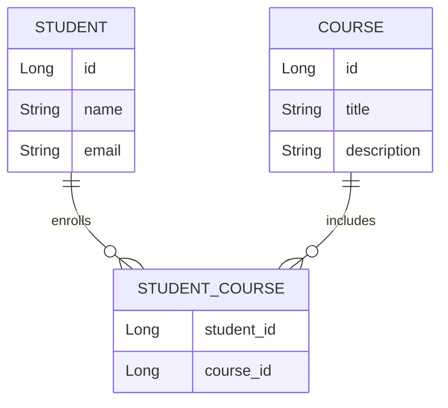
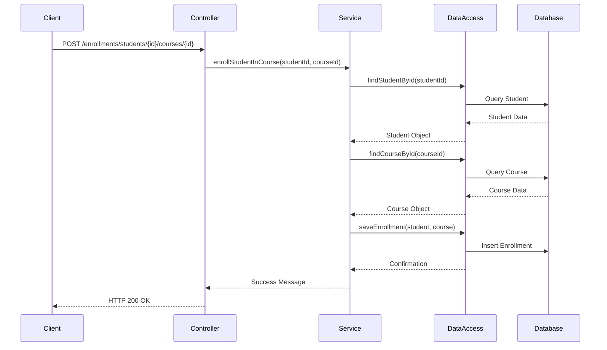
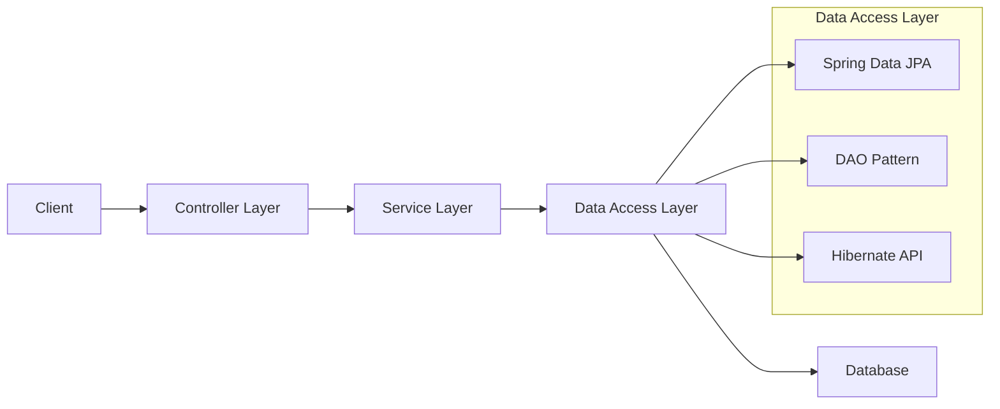

# Data Persistence and ORM in Java

## Table of Contents

1. **Introduction**
2. **Entities and Relationships**
3. **Project Structure**
4. **Approach 1: Spring Data JPA**
5. **Approach 2: Manual DAO Pattern**
6. **Approach 3: Hibernate Native API**
7. **Testing and Demonstration**
8. **Communication Flow and Diagrams**
9. **Q&A and Discussion**
10. **Closing Thoughts**

---

## 1. Introduction 

**Hello everyone,**

Today, we'll explore the crucial concepts of **data persistence** and **Object-Relational Mapping (ORM)** in Java, focusing on a practical **Student-Course management system**. We'll examine three different approaches to data persistence:

1. **Spring Data JPA**
2. **Manual DAO Pattern**
3. **Hibernate Native API**

Our goal is to understand how each approach works, their advantages and disadvantages, and when to use them.

---

## 2. Entities and Relationships

Before diving into the implementation, let's understand the domain model of our application.

### Entities

- **Student**
  - **Attributes**:
    - `id`: Unique identifier.
    - `name`: Name of the student.
    - `email`: Email address.
- **Course**
  - **Attributes**:
    - `id`: Unique identifier.
    - `title`: Course title.
    - `description`: Course description.

### Relationship

- **Many-to-Many** relationship between **Student** and **Course**.
  - A student can enroll in multiple courses.
  - A course can have multiple students.

### ER Diagram



This diagram illustrates the entities and their relationships, with **STUDENT_COURSE** acting as the join table for the many-to-many relationship.

---

## 3. Project Structure

Understanding the project structure helps us see where each component fits.

### Project Directory Structure

```
demo/
├── pom.xml
├── src/
│   ├── main/
│   │   ├── java/
│   │   │   └── com/
│   │   │       └── example/
│   │   │           └── demo/
│   │   │               ├── DemoApplication.java
│   │   │               └── week_5/
│   │   │                   ├── controller/
│   │   │                   │   ├── CourseController.java
│   │   │                   │   ├── CourseControllerDAO.java
│   │   │                   │   ├── EnrollmentController.java
│   │   │                   │   ├── HibernateController.java
│   │   │                   │   ├── StudentController.java
│   │   │                   │   └── StudentControllerDAO.java
│   │   │                   ├── dao/
│   │   │                   │   ├── CourseDAO.java
│   │   │                   │   ├── CourseDAOImpl.java
│   │   │                   │   ├── StudentDAO.java
│   │   │                   │   └── StudentDAOImpl.java
│   │   │                   ├── entity/
│   │   │                   │   ├── Course.java
│   │   │                   │   └── Student.java
│   │   │                   ├── pattern/
│   │   │                   │   ├── HibernateCourseRepository.java
│   │   │                   │   └── HibernateStudentRepository.java
│   │   │                   ├── repository/
│   │   │                   │   ├── CourseRepository.java
│   │   │                   │   └── StudentRepository.java
│   │   │                   ├── service/
│   │   │                   │   ├── CourseService.java
│   │   │                   │   ├── CourseServiceDAO.java
│   │   │                   │   ├── HibernateCourseService.java
│   │   │                   │   ├── HibernateStudentService.java
│   │   │                   │   ├── StudentService.java
│   │   │                   │   └── StudentServiceDAO.java
│   │   │                   └── README.md
│   │   └── resources/
│   │       └── application.yaml
└── data/
    ├── demo-db.mv.db
    └── demo-db.trace.db
```

### Explanation

- **src/main/java/com/example/demo**: Main application code.
  - **DemoApplication.java**: Entry point of the Spring Boot application.
  - **week_5**: Contains all components for our case study.
    - **controller/**: REST controllers handling HTTP requests.
    - **dao/**: Interfaces and implementations for the DAO pattern.
    - **entity/**: Entity classes representing database tables.
    - **pattern/**: Classes using Hibernate Native API.
    - **repository/**: Spring Data JPA repositories.
    - **service/**: Service layer containing business logic.
- **src/main/resources/**: Configuration files.
  - **application.yaml**: Application configuration, such as database settings.
- **data/**: Contains H2 database files.
- **pom.xml**: Maven configuration file specifying dependencies.

---

## 4. Approach 1: Spring Data JPA

**Objective:** Demonstrate how to use Spring Data JPA for data persistence.

### Overview

- **Spring Data JPA** simplifies data access by providing repository interfaces with built-in methods.
- Reduces boilerplate code for common CRUD operations.

### Key Components

1. **Entities**

   - Located in `entity/`:
     - **Student.java**
     - **Course.java**
   - Use annotations:
     - `@Entity`
     - `@Table`
     - `@ManyToMany`
   - Example:

     ```java
     @Entity
     @Table(name = "students")
     public class Student {
         @Id
         @GeneratedValue(strategy = GenerationType.IDENTITY)
         private Long id;
         private String name;
         private String email;

         @ManyToMany
         @JoinTable(
             name = "students_courses",
             joinColumns = @JoinColumn(name = "student_id"),
             inverseJoinColumns = @JoinColumn(name = "course_id")
         )
         private Set<Course> courses = new HashSet<>();
         // Getters and setters...
     }
     ```

2. **Repositories**

   - Located in `repository/`:
     - **StudentRepository.java**
     - **CourseRepository.java**
   - Extend `JpaRepository` to inherit CRUD operations.

   ```java
   public interface StudentRepository extends JpaRepository<Student, Long> {}
   public interface CourseRepository extends JpaRepository<Course, Long> {}
   ```

3. **Service Layer**

   - Located in `service/`:
     - **StudentService.java**
     - **CourseService.java**
   - Use repositories for business logic.

   ```java
   @Service
   public class StudentService {
       @Autowired
       private StudentRepository studentRepository;

       public Student saveStudent(Student student) {
           return studentRepository.save(student);
       }
       // Additional methods...
   }
   ```

4. **Controller Layer**

   - Located in `controller/`:
     - **StudentController.java**
     - **CourseController.java**
   - Handle HTTP requests and map endpoints.

   ```java
   @RestController
   @RequestMapping("/api/students")
   public class StudentController {
       @Autowired
       private StudentService studentService;

       @PostMapping
       public ResponseEntity<Student> createStudent(@RequestBody Student student) {
           Student savedStudent = studentService.saveStudent(student);
           return new ResponseEntity<>(savedStudent, HttpStatus.CREATED);
       }
       // Additional endpoints...
   }
   ```

### Advantages

- **Simplicity**: Less code, faster development.
- **Maintainability**: Easy to manage and extend.
- **Integration**: Works seamlessly with Spring Boot.

---

## 5. Approach 2: Manual DAO Pattern

**Objective:** Illustrate manual database interaction using the DAO pattern.

### Overview

- The **DAO (Data Access Object)** pattern involves writing custom code for data operations.
- Offers full control over SQL queries and transactions.

### Key Components

1. **DAO Interfaces**

   - Located in `dao/`:
     - **StudentDAO.java**
     - **CourseDAO.java**
   - Define methods for data operations.

   ```java
   public interface StudentDAO {
       void save(Student student);
       Student findById(Long id);
       List<Student> findAll();
       // Additional methods...
   }
   ```

2. **DAO Implementations**

   - Located in `dao/`:
     - **StudentDAOImpl.java**
     - **CourseDAOImpl.java**
   - Use `EntityManager` for database interactions.

   ```java
   @Repository
   public class StudentDAOImpl implements StudentDAO {
       @PersistenceContext
       private EntityManager entityManager;

       @Override
       public void save(Student student) {
           entityManager.persist(student);
       }

       @Override
       public Student findById(Long id) {
           return entityManager.find(Student.class, id);
       }
       // Additional methods...
   }
   ```

3. **Service Layer**

   - Located in `service/`:
     - **StudentServiceDAO.java**
     - **CourseServiceDAO.java**
   - Use DAO implementations for business logic.

   ```java
   @Service
   public class StudentServiceDAO {
       @Autowired
       private StudentDAO studentDAO;

       public void saveStudent(Student student) {
           studentDAO.save(student);
       }
       // Additional methods...
   }
   ```

4. **Controller Layer**

   - Located in `controller/`:
     - **StudentControllerDAO.java**
     - **CourseControllerDAO.java**
   - Handle HTTP requests for DAO-based operations.

   ```java
   @RestController
   @RequestMapping("/api/dao/students")
   public class StudentControllerDAO {
       @Autowired
       private StudentServiceDAO studentServiceDAO;

       @PostMapping
       public ResponseEntity<Void> createStudent(@RequestBody Student student) {
           studentServiceDAO.saveStudent(student);
           return new ResponseEntity<>(HttpStatus.CREATED);
       }
       // Additional endpoints...
   }
   ```

### Advantages

- **Full Control**: Customize queries and transactions.
- **Flexibility**: Handle complex scenarios.
- **Transparency**: Clear understanding of data operations.

---

## 6. Approach 3: Hibernate Native API

**Objective:** Demonstrate advanced operations using Hibernate's native API.

### Overview

- Using Hibernate's Session API directly for data operations.
- Access to advanced features and optimizations.

### Key Components

1. **Hibernate Repositories**

   - Located in `pattern/`:
     - **HibernateStudentRepository.java**
     - **HibernateCourseRepository.java**
   - Use `SessionFactory` and `Session` for operations.

   ```java
   @Repository
   public class HibernateStudentRepository {
       private SessionFactory sessionFactory;

       @Autowired
       public HibernateStudentRepository(EntityManagerFactory factory) {
           if(factory.unwrap(SessionFactory.class) == null){
               throw new NullPointerException("Not a Hibernate factory");
           }
           this.sessionFactory = factory.unwrap(SessionFactory.class);
       }

       public void save(Student student) {
           Session session = sessionFactory.openSession();
           Transaction tx = session.beginTransaction();
           session.save(student);
           tx.commit();
           session.close();
       }
       // Additional methods...
   }
   ```

2. **Service Layer**

   - Located in `service/`:
     - **HibernateStudentService.java**
     - **HibernateCourseService.java**
   - Use Hibernate repositories for business logic.

   ```java
   @Service
   public class HibernateStudentService {
       @Autowired
       private HibernateStudentRepository studentRepository;

       public void saveStudent(Student student) {
           studentRepository.save(student);
       }
       // Additional methods...
   }
   ```

3. **Controller Layer**

   - Located in `controller/`:
     - **HibernateController.java**
   - Handle HTTP requests for Hibernate-based operations.

   ```java
   @RestController
   @RequestMapping("/api/hibernate/students")
   public class HibernateController {
       @Autowired
       private HibernateStudentService studentService;

       @PostMapping
       public ResponseEntity<Void> createStudent(@RequestBody Student student) {
           studentService.saveStudent(student);
           return new ResponseEntity<>(HttpStatus.CREATED);
       }
       // Additional endpoints...
   }
   ```

### Advantages

- **Advanced Features**: Access to caching, batching, and more.
- **Performance Optimization**: Fine-tune queries.
- **Customization**: Greater control over ORM behavior.

---

## 7. Testing and Demonstration

**Objective:** Show the application in action using Swagger UI and H2 Console.

### Using Swagger UI

1. **Access Swagger UI**

   - Navigate to `http://localhost:8080/swagger-ui.html`.

2. **Demonstration Steps**

   - **Create a Student**
     - **Endpoint**: `POST /api/students`
     - **Request Body**:

       ```json
       {
         "name": "Alice Johnson",
         "email": "alice.johnson@example.com"
       }
       ```

   - **Create a Course**
     - **Endpoint**: `POST /api/courses`
     - **Request Body**:

       ```json
       {
         "title": "Algorithms",
         "description": "Study of algorithms."
       }
       ```

   - **Enroll Student in Course**
     - **Endpoint**: `POST /api/enrollments/students/{studentId}/courses/{courseId}`
     - Replace `{studentId}` and `{courseId}` with actual IDs.

   - **Retrieve Data**
     - **Endpoint**: `GET /api/students/{id}`
     - View student details and enrolled courses.

### Using H2 Console

1. **Access H2 Console**

   - Navigate to `http://localhost:8080/h2-console`.

2. **Configuration**

   - **JDBC URL**: `jdbc:h2:file:./data/demo-db`
   - **Username**: `sa`
   - **Password**: (leave blank unless set)

3. **Run Queries**

   - **View Students**

     ```sql
     SELECT * FROM students;
     ```

   - **View Courses**

     ```sql
     SELECT * FROM courses;
     ```

   - **View Enrollments**

     ```sql
     SELECT * FROM students_courses;
     ```

4. **Explanation**

   - Show how data corresponds to operations performed via Swagger UI.
   - Highlight relationships in the join table.

---

## 8. Communication Flow and Diagrams

**Objective:** Visualize how components interact in each approach.

### Sequence Diagram

**Scenario**: Enrolling a student in a course.



### Architecture Diagram



### Explanation

- **Client**: Initiates the request.
- **Controller Layer**: Receives the request and calls the service layer.
- **Service Layer**: Contains business logic and interacts with the data access layer.
- **Data Access Layer**: Performs data operations using one of the three approaches.
- **Database**: Stores the persistent data.

---

## 9. Q&A and Discussion

**Objective**: Engage students and clarify doubts.

### Anticipated Questions and Answers

1. **Why use Spring Data JPA over manual DAOs?**

   - **Answer**: Spring Data JPA reduces boilerplate code and accelerates development for standard CRUD operations. It's ideal when custom queries aren't needed.

2. **When is the DAO pattern preferable?**

   - **Answer**: When you need full control over database interactions, such as custom queries or complex transactions.

3. **What are the benefits of using Hibernate's native API?**

   - **Answer**: Access to advanced features and performance optimizations not available through JPA alone.

4. **How does the `@ManyToMany` relationship work?**

   - **Answer**: It establishes a many-to-many association using a join table that contains foreign keys to both entities.

5. **How do we prevent infinite recursion in JSON responses?**

   - **Answer**: By using Jackson annotations like `@JsonManagedReference` and `@JsonBackReference` to control serialization.

6. **Can we mix different approaches in a single application?**

   - **Answer**: Yes, but it's important to maintain clear separation and manage dependencies carefully.

---

## 10. Closing Thoughts

**Summary:**

- **Spring Data JPA**: Ideal for rapid development with standard CRUD operations.
- **Manual DAO Pattern**: Offers full control for custom requirements.
- **Hibernate Native API**: Provides advanced features and performance optimization.

**Real-world Application:**

- Each approach has its place depending on project needs.
- Understanding them allows for informed decision-making.

**Encouragement:**

- Experiment with each approach.
- Explore further into ORM and data persistence.
- Apply these concepts to your projects.

---

## Additional Resources

- **Spring Data JPA Documentation**: [https://spring.io/projects/spring-data-jpa](https://spring.io/projects/spring-data-jpa)
- **Hibernate ORM Documentation**: [https://hibernate.org/orm/documentation/5.4/](https://hibernate.org/orm/documentation/5.4/)
